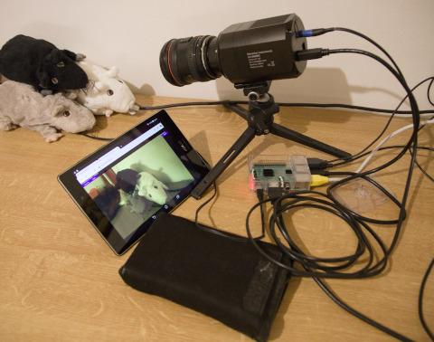

# CCD Camera Imaging Software for Moravian Instruments Cameras

This is an attempt to build a standalone imaging service running on
Raspberry Pi that can be remotely controlled with a web browser.
Project is in the early stage of development, far from being usable for now,
however basic proof of concept is already working.

## Goals

Web application GUI for
 - easy composition of the whole image
 - focusing the image
 - setting camera cooling parameters
 - controlling batch imaging

Service
 - running on a PC or Raspberry PI
 - allowing standalone batch imaging

## Stage of the Project

Working proof of concept - the following image shows CCD camera powered with
a power bank connected to a Raspberry PI 3 microcomputer running the
control and web service. Android tablet runs the web interface and is
already able to take image exposure and present it in the GUI.



## Supported platforms

Software now runs on:
 - linux PC (x86_64)
 - Raspberry PI 3 (armv7)
 - Raspberry PI 4 (aarch64)

## Technologies

Project uses following drivers / technologies
 - official gxccd driver for moravian cameras written in C, wrapper for Rust
   was developed with help of `bindgen` for generating Rust headers
 - server uses `warp` and `tokio`
 - client is written in `yew` and is compiled into WebAssembly

## Installing Dependencies to build Web Service

In order to build the web service, following debian packages are needed

`apt install libusb-1.0-0-dev llvm-dev libclang-dev clang libcfitsio-dev`

Web service in the repository already contains client WASM binaries compiled
previously, so it is only needed to build the web service on the target
platform.

Service build on on Raspberry PI 3 equipped with 1 GB od RAM without problems
so i did not bother with crosscompiling it.

To run the web service, run:

```
cd ccdi-web-service
cargo run --release
```

## Installing Dependencies for Web Client Development

To install the trunk server (dev server for hosting and reloading web service
upon change), type:

`cargo install --locked trunk`

To run the client in the dev server, run:

```
cd ccdi-web-client
trunk serve --release --open
```

## Enabling permissions for moravian camera

In case of the following error:
`[gxccd] error: my_libusb_open(): libusb_open failed: -3, LIBUSB_ERROR_ACCESS`

Current user does not have sufficient permissions to work with the camera.

Create text file `/etc/udev/rules.d/98-moravian.rules`

And insert the following content
```
# Moravian camera
ATTRS{idVendor}=="1347", ATTRS{idProduct}=="0ca0", MODE:="0666"
```

Reload UDEV rules and reconnect the device

 * `sudo udevadm control --reload-rules`
 * OR `sudo systemctl restart udev`

# Notes

Tool to view FITS images: QFitsView - `sudo apt install qfitsview`

